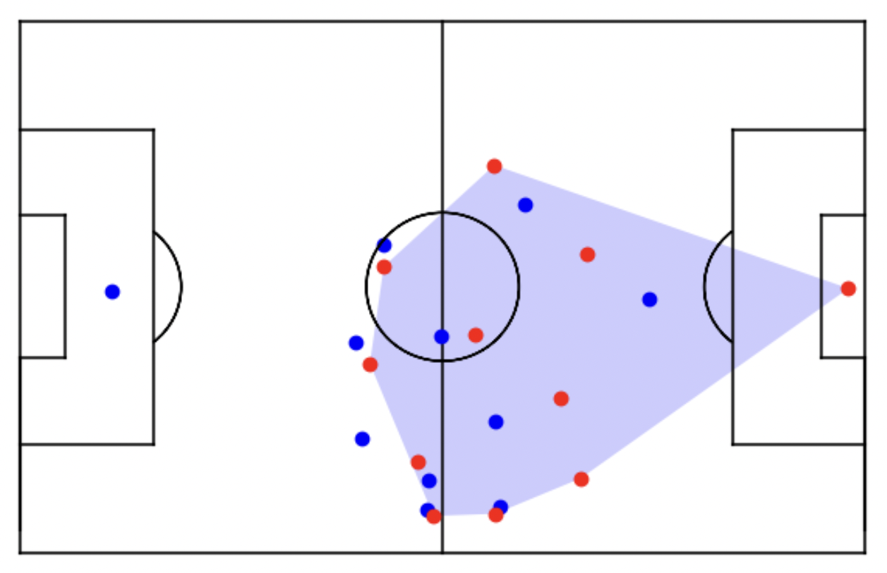

# Pass and Geospatial Analysis

## Project Description

This project focuses on the analysis of passing actions and the spatial dynamics of an anonymous team. By leveraging data from tracking events, we aim to gain insights into the team's playing style through various metrics and visualizations.

## Key Features

- **Pass and Drive Analysis**: The project filters successful passes and drives, analyzing their distances and categorizing them into short, mid-range, and long distances.
  
- **Geospatial Visualizations**: The field is represented in a geospatial context, allowing for visual analysis of player movements and ball distribution on the pitch.

- **Convex Hull Calculations**: By calculating the convex hulls of player positions, we gain insights into team formations and defensive structures.
  

- **Action Transition Analysis**: The project computes percentages of passing and driving actions that transition between different areas of the pitch, including:
  - **From Outside to Inside the Box**
  - **From Inner to Wide Areas**
  - **From Outside to Inside Half-Spaces**
  - **From Inside to Outside the Convex Hull**
  - **Into the Convex Hull**
  - **Presence in the Opponent's Half**
